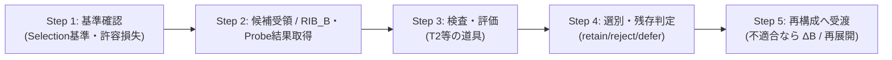

# T1_検査と選別

*T1：SILN操作層 / OP / 統合改定案 v2.1*  
*依存：T0 基底措定（BASE）v2.3 / T0 最低動作仕様（SPEC）v2.3 / T1_SILN操作_総論.md*  
*対文書：T1_SILN展開.md / T1_再構成.md*  
*同期主題：SILN基底化 / RIB・RIB_B導入*

---

## ■ 0. 位置づけ

本文書は、SILN操作における **評価・絞り込みフェーズである「検査と選別（Inspection & Selection）」** の目的、必須手順、Probe と Selection の位置づけ、情報源の拘束評価、および各系設計層への委託仕様を定める。

SILN展開が、対象化した SILN と `RIB_B` 列等から関係や候補の可能性空間を「広げる」のに対し、検査と選別は **展開された候補群に負荷・比較・評価を与え、現在の有限境界 $B$、目的、制約に対して残存可能な構造を局所的に絞り込む**責務を担う。

SILN は基底構造であり、検査対象は「SILNという別種の食材」ではない。外部対象、自己側 $M_B$、Probe、Selection 規則、理論、検査器自身も、必要に応じて SILN として対象化しうる。

---

## ■ 1. 検査と選別の必須5工程（Core Procedure）



```text
Step 1: 検査基準・制約の確認（Criteria Setup）
        現在の B に含まれる用途・問い・制約条件、
        および各系設計で定められた Selection 基準・許容損失を確認する。

Step 2: 候補受領と作用断面・Probe結果の取得（Candidate & Section Intake）
        通常時は SILN展開から M_{B,target} / 候補構造群 / RIB_B 列等を受け取る。
        高負荷再編時 M_Δ では Probe により条件を変え、
        RIB_B^{probe,k} とその解釈・差分を追加取得する。

Step 3: 検査・評価の実施（Inspection & Evaluation）
        T2耐久検査、統計検定、シミュレーション、実験等を適用し、
        候補構造の適合性・再現性・有効範囲・破断条件を測定する。

Step 4: 適合構造の選別と残存抽出（Selection Execution）
        Selection_{B,goal} に従い、候補を retain / reject / defer に分類し、
        現在の目的・制約下で残存可能な関係核を抽出する。

Step 5: 再構成への受け渡し・ΔB要求（Handoff or ΔB）
        残存構造と有効条件を T1 再構成へ渡す。
        候補がすべて破綻する、または問い自体が不適切と判定される場合は、
        ΔB または再展開を要求する。
```

---

## ■ 2. Probe と Selection の設計責務

### 2.1 Probe：RIB 全体や ξ を直接取得しない

RDL において $\xi$ は「未知物の貯蔵庫」ではなく、有限境界 $B$ に伴って残る未回収関係である。また `RIB` は関係ネットワーク上の相互作用束の一般記号であり、その全体を完全取得できるとは仮定しない。

したがって Probe は、

> **対象 SILN または相互作用条件へ有限な探りを入れ、その結果として変化して成立する `RIB_B` を取得・比較する操作**

として定式化する。

```text
Probe_B(target, condition_k)
  → RIB_B^{probe,k}

F_k = interp(M_B, RIB_B^{probe,k})

{Δ}_B = Compare({RIB_B^{probe,k}}, {F_k}, prior)
with ξ'(B) ≠ 0
```

ここで `{Δ}_B` は Probe 前後・条件間・解釈間の有限差分を表す補助表記であり、世界そのものや RIB 全体を直接回収したものではない。

Probe の具体実装は各系設計に委ねる。

- **人間・生物**：視線移動、触覚探索、嗅覚サンプリング、試しの発話、身体運動。
- **AI・計算機**：テストプロンプト、ping、ダミーデータ注入、試行実行、API問い合わせ。
- **組織・社会**：パイロット運用、市場テスト、A/Bテスト、小規模制度変更。
- **物理系**：刺激条件、負荷、温度、圧力、境界条件等の制御。

Probe を行っても $\xi=0$ にはならない。Probe は未知を消去するのではなく、**現在の B で比較可能な新しい `RIB_B` を作る**。

### 2.2 Selection と T2 の分離：工程と道具

```text
【T1 の責務】
  Selection が代謝工程として必要であることと抽象 I/O を規定する。

  Selection_{B,goal}(candidate, evidence)
    → retain / reject / defer

【T2 の責務】
  Selection に利用できる汎用検査・評価機構を提供する。
  例：SILN耐久検査、統計検定、シミュレータ、整合性検査器

【各系設計の責務】
  何を目的とし、どの損失まで許容し、何を破断とみなすか、
  どの RIB_B を観測証拠として用いるかを具体化する。
```

> **`Selection ≠ T2`**  
> Selection は選別工程・基準設計であり、T2 はそこで使える道具を提供する。

### 2.3 情報源・外部データの拘束評価（Source Constraint）

外部文書・DB・API・発話・観測装置等は、それ自体を絶対的な「信頼度スコア」で固定しない。

情報源も SILN として成立しており、そこから現在の観測者へ届く情報は、媒体・時点・問い・観測条件を通じて有限な `RIB_B` として取得される。そのため、Selection では、

```text
constraint(source, question, target, time, domain, B)
```

のように、**その問い・対象・時点・領域・境界において解釈可能域をどの程度拘束するか**を評価する。

- 制度的公式記録は特定の事実確認に強い拘束を持ちうるが、価値判断や妥当性評価に同じ強さを持つとは限らない。
- 複数ソースが同じ候補構造を独立に拘束する場合、候補の可能域は狭まりうる。
- 情報源同士が同じ上流 RIB・同じデータ生成過程を共有する場合、見かけ上の独立性を過大評価しない。

### 2.4 Probe / Selection の自己例外化禁止

Probe、Selection 基準、検査道具、評価関数も有限構造である。したがって、それら自身が環境変化や目的変化で破断した場合は、`[SELF]` に従って SILN として対象化し、展開・検査・再構成へ戻す。

```text
Probe / Selection / Tool
  ↓ 対象化
SILN_SELF
  ↓
展開 → 検査 → 選別 → 再構成
```

---

## ■ 3. 多様な検査手段（T2 等が提供する道具群）

```text
候補構造群
+ RIB_B 列
+ Probe による RIB_B^{probe,k}
+ F / E / H / 既知データ
  ↓
【検査道具（Evaluation Tools）】
  ├─ Tool 1 : 統計的検定・ベイズ更新
  ├─ Tool 2 : 実験・実地運用
  ├─ Tool 3 : シミュレーション・制御理論
  ├─ Tool 4 : SILN耐久検査
  └─ Tool 5 : 論理・整合性検査
  ↓
【Selection_{B,goal}】
  ↓ retain / reject / defer
残存関係・有効条件・破断条件
  ↓
【T1 再構成へ】
```

検査結果は「候補が真である」ことを証明するためではなく、**現在の B と目的のもとで、どの構造がどこまで残存可能かを絞る**ために用いる。

---

## ■ 4. Aporapeiron 条件下での選別原則

1. **局所的選定**：選別は、現在の有限 $B$・目的・制約のもとでの残存判定である。
2. **$\xi$ の暗黙継承**：retain された構造も $\xi$ を伴い、終端真理にはならない。
3. **RIB 条件の明示**：候補がどの RIB / `RIB_B` 条件下で残存したかを可能な範囲で保持する。
4. **破断時の開放**：運用中に $H \ge \theta$ となれば、以前の選別結果を固着させず $M_\Delta$ / $\Delta B$ / 再展開へ戻す。
5. **defer の許容**：情報不足や境界不足のとき、retain/reject を強制せず defer とし、追加 Probe や別 $B$ を要求できる。

---

## ■ 5. 一文圧縮

> **検査と選別とは、SILN展開で得られた候補構造を、`RIB_B` 列・Probe による作用断面変化・既知データ等に照らして検査し、現在の有限境界 $B$・目的・許容損失に対して残存可能な関係を retain / reject / defer として絞り込み、再構成へ渡す T1 操作である。**

---

## ■ 6. 改訂メモ

- **v2.1（SILN基底化・RIB同期）**
  - Probe を `Probe_B(interaction) → {Δ}_B` から、条件変更による `RIB_B^{probe,k}` の取得・比較へ再定義。
  - RIB 全体および $\xi$ を直接取得対象としないことを明記。
  - 情報源から得る情報も、現在の $B$ における有限作用断面として評価する構造へ同期。
  - Selection / T2 / 各系設計の責務分担は維持。
