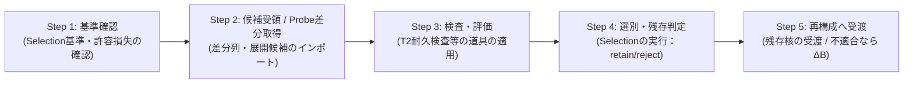

# T1_検査と選別

*T1：SILN操作層 / OP / 統合改定案 v1.3*  
*依存：T0 基底措定（BASE） / T0 最低動作仕様（SPEC） / T1_SILN操作_総論.md*  
*対文書：T1_SILN展開.md / T1_再構成.md*

---

## ■ 0. 位置づけ

本文書は、SILN操作における**評価・絞り込みフェーズである「検査と選別（Inspection & Selection）」の目的、必須手順、未知接触における Probe と Selection の位置づけ、および各系設計層への委託仕様**を定める。

SILN展開が関係や候補の可能性空間を「広げる」のに対し、検査と選別は**「展開された候補群に対して評価・検査を行い、現在の境界 $B$ と目的に耐えうる構造を局所的に絞り込む（残存させる）」**責務を担う。

---

## ■ 1. 検査と選別の必須5工程（Core Procedure）



```text
Step 1: 検査基準・制約の確認（Criteria Setup）
        現在の境界 B に含まれる目的、制約条件、および各系設計で定められた Selection 基準（破断閾値・許容損失）を確認する。

Step 2: 候補受領と Probe 差分取得（Candidate Intake & Probe Sampling）
        通常時は SILN展開の出力群を受け取る。
        高負荷再編時（M_Δ）は、ξ を伴う相互作用に対して Probe_B を行い、B 内で取得可能な差分列 {Δ}_B および候補構造群を受け取る（with ξ' ≠ 0）。

Step 3: 検査・評価の実施（Inspection & Evaluation）
        目的に応じた適切な検査道具（T2耐久検査、統計検定、シミュレーション等）を適用し、候補の耐久性・再現性を測定する。

Step 4: 適合構造の選別と残存抽出（Selection Execution）
        各系設計の基準に基づき Selection_{B,goal} を実行し、環境・制約に耐えうる関係構造を選び出し、破綻候補を落とす。

Step 5: 再構成への受け渡し・ΔB要求（Handoff or ΔB）
        選別・残存した構造を T1 再構成モジュールへ渡す。全候補が破綻した場合は ΔB を要求する。
```

---

## ■ 2. 未知接触における `Probe` と `Selection` の設計責務

未知の相互作用から新たな $M_B'$ を析出させる高負荷再編時において、`Probe` と `Selection` は不可欠な両輪となる。ただし、これらは基底やT1で一意に固定されるものではなく、明確な階層分担を持つ。

### 2.1 `Probe_B` の定式化：ξ は対象物（貯蔵庫）ではない

RDLにおいて $\xi$ は「Probe できる対象物」や「未知の貯蔵庫」ではなく、**有限境界 $B$ を引いたことに伴って必然的に生じる残存条件**である。  
したがって、Probe の操作は次のように定式化される。

```text
Probe_B(interaction) → {Δ}_B
with ξ'(B) ≠ 0
```

* **意味**: $\xi$ を伴う未分化な相互作用に対し、有限境界 $B$ のもとで能動的に探り（極小接触）を入れ、$B$ 内で取得・比較可能な差分列 $\{\Delta\}_B$ を刈り取る。
* **残存性の保持**: $\xi'$ は Probe の出力（計算・生成物）ではなく、有限境界 $B$ を用いた結果として依然として回収されずに残る条件である。Probe によって世界が全回収されることはなく、必ず新たな $\xi'(B) \neq 0$ が残存する（$[B\text{-}\xi]$ の貫徹）。

具体的になにを物理入力とし、どう刺激し、どの分解能・周波数で測るかは、**各系の境界／身体／センサ／API を設計する場所（各系設計）**へ委任する。

* **人間・生物**: 網膜の微小振動（サッカード）、指先のなぞり、呼気スニッフィング、探りの発話
* **AI・計算機**: ping、テストプロンプト、ダミーデータ注入、1ステップの試行実行
* **組織・社会**: パイロットプロジェクト、市場テスト、A/Bテスト

### 2.2 `Selection` と `T2` の明確な分離：道具と設計

ここで最も重要なのは、**「Selection（選別設計）」と「T2（検査道具）」を混同しないこと**である。

```text
【T1 の責務】
  Selection が代謝工程として必要であること、および抽象 I/O を規定する。
  Selection_{B,goal}(candidate) → retain / reject / defer

【T2 の責務】
  Selection に利用可能な「汎用の検査・評価機構（道具）」を提供する。
  例：SILN耐久検査、極限ストレステスト、整合性検証器、統計検定モジュール

【各系設計の責務】
  その道具を用いて、何を破断とみなし、何を retain / reject / defer とするかの
  「具体的な判断基準・許容損失」を設計する。
```

> **重要原則：**  
> **`Selection = 各系における基準設計`** であり、  
> **`Durability Test (T2) = Selection に利用できる道具`** である。  
> したがって **`Selection ≠ T2`** である。

### 2.3 Probe と Selection の自己例外化禁止

Probe（観測インターフェース）も Selection（評価基準）もそれ自体が有限構造である。  
したがって、環境変化によってそれら自身が破断・機能不全を起こした場合は、RDL の自己例外化禁止（B5）に基づき、**Probe / Selection 自体を SILN_SELF として解剖・再設計**しなければならない。

---

## ■ 3. 多様な検査手段（T2が提供する道具群）

```text
展開された候補群 / Probe差分列
  ↓
【T2 等が提供する検査道具（Evaluation Tools）】
  ├─ Tool 1 : 統計的検定・ベイズ更新（データ適合度の測定）
  ├─ Tool 2 : 実験・実地運用（物理・実務現場での動作測定）
  ├─ Tool 3 : シミュレーション・制御理論（計算機上の動的安定性測定）
  ├─ Tool 4 : SILN耐久検査（T2：極限負荷による有効限界の測定）
  └─ Tool 5 : 論理・整合性検査（矛盾の有無・演繹的一貫性の検証）
  ↓
【各系設計に基づく Selection の実行】（retain / reject / defer）
  ↓
選別・残存した構造（新 M_B' の核）
  ↓
【T1 再構成へ受け渡し】（新 M_B' 定着）
```

---

## ■ 4. Aporapeiron 条件下での選別原則

1. **局所的選定**: 選別は「現在の有限 $B$ と目的の下で最も頑健に機能する構造の選択」である。
2. **$\xi$ の暗黙継承**: 選ばれた残存構造も未回収関係 $\xi$ を伴っており、絶対的真理ではない。
3. **破断時の開放**: 運用中に熱 $H$ が蓄積し $\theta$ を超えたら、選別結果を固着させず速やかに $M_\Delta$ / $\Delta B$ へ戻る。

---

## ■ 5. 一文圧縮

> 検査と選別とは、通常時は展開候補を、高負荷再編時（$M_\Delta$）には Probe によって取得された差分列から、T2 等の検査道具を用いつつ各系設計の基準（Selection）に従って頑健な関係を絞り込み、再構成（新 $M_B'$ の定着）へと渡す T1 操作である。